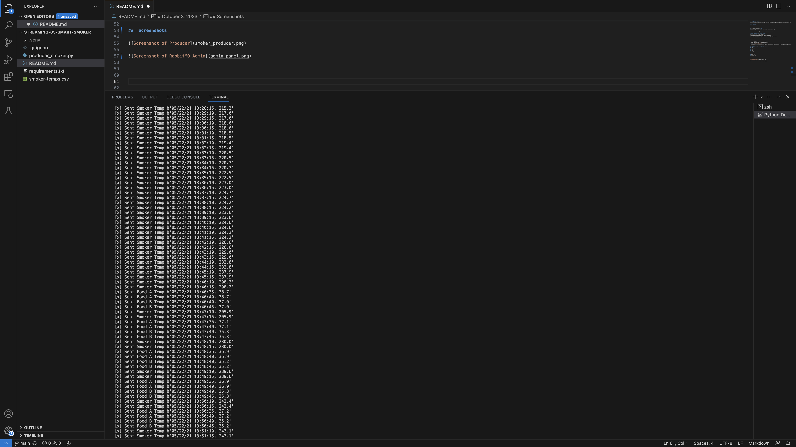

# streaming-05-smart-smoker
This coding project creates a streaming data producer forstreaming sensor data from a smart smoker system. The data from the smart smoker is stored in a CSV file, and the producer reads this data and places it into RabbitMQ queues. The data includes temperature readings for the smoker itself and two food items (Food A and Food B), with readings taken every 30 seconds.

# John Hickman 
# October 3, 2023

## Getting Started

  <B> Before You Begin </b> 
 
Before running the producer, ensure the following requirements are met:

- RabbitMQ server is running.
- The pika library is installed in your active Python environment.

## The key features of this project include:

- Reading sensor data from the CSV file.
- Sending data to RabbitMQ queues with specific queue names.
- Simulating sensor data streaming at a rate of one reading every 30 seconds.
- Opening the RabbitMQ Admin website for queue monitoring.

## How to Use

1. Clone this repository to your local machine.
2. Make sure RabbitMQ is running.
3. Install the pika library if not already installed
4. Execute the `producer_smoker.py` script.
5. You will be prompted to open the RabbitMQ Admin website for monitoring queues if desired 
6. The producer will start sending sensor data to the named queues with a frequency of one reading every 30 seconds. 

## The following modules are used in this project:
  csv	
  webbrowser
  signal	
  sys	
  time	
  pika
<b>  socket

## Prerequisites
 Github
 Python 3.12 
 VS Studio Code 
 RabbitMQ

## Multiple Terminals Screenshots

